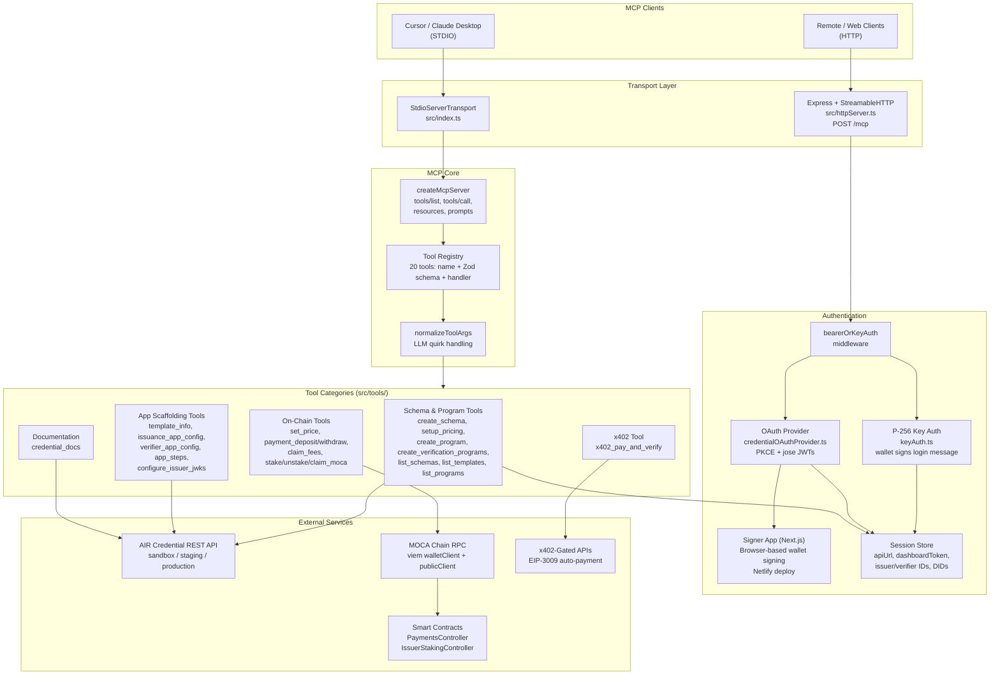

# Animoca Credential MCP Server

An MCP server that brings AI-powered Web3 credential management to Cursor, Claude, and other MCP-compatible clients -- from schema creation to on-chain staking in natural language.

Built by [Guru Ramu](https://github.com/gururamu).

---

## The Problem

Building and managing credential systems on the AIR/MOCA ecosystem requires navigating multiple dashboards, REST APIs, chain RPCs, and payment contracts. Each step in the credential lifecycle -- schema creation, pricing configuration, issuance program setup, verification program deployment, on-chain staking, USD8 payment management -- lives in a different interface. AI agents, which are increasingly the primary interface for developers, cannot operate any of these systems. This blocks the vision described in the AIR x ERC-8004 Delegated Verification Framework: agents that can autonomously verify user credentials with proof reuse. At the identity vertex of the Golden Triangle (Digital Identity + Stablecoin + AI), credential infrastructure must be agent-operable for delegated verification to work at scale.

---

## The Solution

An MCP server that exposes the entire credential lifecycle as 20 natural-language tools. An AI agent in Cursor or Claude Desktop can create schemas, configure pricing, deploy issuance and verification programs, manage on-chain staking and USD8 payments, scaffold template apps, and call x402-gated APIs -- all through conversation. The server handles P-256 authentication, chain interactions via viem, and x402 payment protocol integration. It enables the M2 milestone (delegated identity + verification gateway) by making credential infrastructure agent-operable -- the foundation for the AgentDelegationRegistry and proof cache layer described in the ERC-8004 framework.

---

## Demo

### Credential Lifecycle

<video src="assets/demo-credential-lifecycle.mp4" width="100%" autoplay loop muted playsinline></video>

### Cursor Integration

<video src="assets/demo-cursor-integration.mp4" width="100%" autoplay loop muted playsinline></video>

### App Scaffolding

<video src="assets/demo-app-scaffolding.mp4" width="100%" autoplay loop muted playsinline></video>

---

## Features

- **21 MCP tools** accessible via natural language in Cursor, Claude Desktop, or any MCP client
- **Full credential lifecycle**: schema creation, pricing setup, credential template management, verification program creation and deployment
- **Private-key authentication** using P-256 ECDSA signatures -- no OAuth browser flow required for STDIO mode
- **On-chain operations** via viem + smart contracts on MOCA Chain: stake/unstake MOCA, set verification price, deposit/withdraw USD8, claim issuer fees
- **x402 payment protocol**: AI agents call x402-gated APIs with automatic payment handling using EIP-3009 `transferWithAuthorization`
- **Dual transport**: STDIO for Cursor/Claude Desktop, Streamable HTTP for remote and web-based clients
- **Signer app** (Next.js): browser-based companion for on-chain signing when a local private key is not available
- **Central tool registry**: single-file registration of name, schema, and handler -- no scattered switch statements
- **Code quality**: ESLint 9 flat config + Prettier, with validation tests for every tool

---

## Architecture



### Simplified Flow

```mermaid
flowchart LR
    subgraph Client
        A[Cursor / Claude Desktop]
    end

    subgraph MCP Server
        B[Tool Registry]
        C[Auth Layer<br/>P-256 Key &#124; OAuth]
        D[Chain Module<br/>viem]
        E[x402 Module<br/>payingFetch]
    end

    subgraph External Services
        F[AIR Credential API]
        G[MOCA Chain<br/>Payments &#124; Staking]
        H[x402-Gated APIs]
    end

    A -- STDIO / HTTP --> B
    B --> C
    C --> F
    B --> D
    D --> G
    B --> E
    E --> H
```



---

## Quick Start

### Prerequisites

- Node.js >= 18
- pnpm (recommended) or npm

### 1. Clone and install

```bash
git clone https://github.com/anthropics/credential-mcp-server.git
cd credential-mcp-server
pnpm install
```

### 2. Configure environment

```bash
cp .env.example .env
```

Open `.env` and set the required values:

| Variable | Purpose |
|---|---|
| `CREDENTIAL_MCP_ENVIRONMENT` | `sandbox`, `staging`, or `production` |
| `CREDENTIAL_MCP_PRIVATE_KEY` | Wallet private key (hex) -- enables on-chain + x402 tools |
| `CREDENTIAL_API_SIGNATURE_KEY` | API signature key (optional override) |

All chain-related variables (`MOCA_RPC_URL`, `MOCA_CHAIN_ID`, contract addresses) are auto-derived from the environment setting. Override them only when needed.

### 3. Build

```bash
pnpm build
```

### 4. Run

**STDIO mode** (Cursor / Claude Desktop):

```bash
node dist/index.js
```

**HTTP mode** (remote clients, browser):

```bash
node dist/httpServer.js
# Listening on http://localhost:3749
```

---

## MCP Tools Reference

### Credential Management

| Tool | Purpose |
|---|---|
| `credential_create_schema` | Create and publish a new credential schema with custom data points |
| `credential_setup_pricing` | Configure pricing model (per-attempt or pay-on-success) for a schema |
| `credential_create_program` | Create an issuance program (credential template) from a schema |
| `credential_create_verification_programs` | Create and deploy verification programs with condition-based rules |
| `credential_list_schemas` | List credential schemas (own or others) |
| `credential_list_templates` | List credential templates (issuance programs) |
| `credential_list_programs` | List verification programs |
| `credential_docs` | Get step-by-step documentation for issuance and/or verification flows |

### App Scaffolding

| Tool | Purpose |
|---|---|
| `credential_template_info` | Get repo URL, branch, and clone command for issuance/verifier template apps |
| `credential_issuance_app_config` | Generate `.env` configuration for the issuance template |
| `credential_verifier_app_config` | Generate `.env` configuration for the verifier template |
| `credential_app_steps` | Get ordered develop-to-deploy steps for issuance or verifier apps |
| `credential_configure_issuer_jwks` | Set JWKS URL and whitelist domain for credential issuance |

---

## On-Chain Tools

These tools interact directly with smart contracts on MOCA Chain via viem. They require `CREDENTIAL_MCP_PRIVATE_KEY` (or `CREDENTIAL_MCP_SEED_PHRASE`) to be set.

| Tool | Purpose |
|---|---|
| `credential_set_price` | Set or update verification price on-chain (PaymentsController) |
| `credential_payment_deposit` | Deposit USD8 to a verifier's on-chain balance |
| `credential_payment_withdraw` | Withdraw USD8 from a verifier's on-chain balance |
| `credential_payment_claim_fees` | Claim accumulated issuer fees from the PaymentsController |
| `credential_stake_moca` | Stake native MOCA to increase issuer usage quota |
| `credential_unstake_moca` | Initiate MOCA unstake (subject to delay period) |
| `credential_claim_unstake_moca` | Claim MOCA after the unstake delay has elapsed |

### Example: natural-language on-chain operation

> "Stake 100 MOCA for my issuer"

The agent resolves `credential_stake_moca`, builds and signs the transaction using your configured wallet, submits it to MOCA Chain, and returns the transaction hash.

---

## x402 Payment Protocol

The `x402_pay_and_verify` tool enables AI agents to call x402-gated HTTP endpoints with automatic payment. Under the hood it uses `@x402/fetch` to detect `402 Payment Required` responses, construct an EIP-3009 `transferWithAuthorization` signature, and retry the request with the payment proof attached.

| Tool | Purpose |
|---|---|
| `x402_pay_and_verify` | Call any x402-protected API with transparent on-chain payment |

**How it works:**

1. The agent calls the target URL via `payingFetch`.
2. If the server responds with `402`, the x402 SDK reads the payment requirements from the response header.
3. A `transferWithAuthorization` signature is constructed and sent as a payment proof.
4. The server verifies the payment on-chain and returns the protected resource.

No manual token approvals or pre-funding steps are needed beyond having USD8 in the wallet.

---

## Try It in Cursor

Add this to your Cursor MCP configuration (`.cursor/mcp.json`):

```json
{
  "mcpServers": {
    "animoca-credentials": {
      "command": "node",
      "args": ["/absolute/path/to/credential-mcp-server/dist/index.js"],
      "env": {
        "CREDENTIAL_MCP_ENVIRONMENT": "staging",
        "CREDENTIAL_MCP_PRIVATE_KEY": "0x...",
        "CREDENTIAL_API_SIGNATURE_KEY": "your-api-signature-key"
      }
    }
  }
}
```

Replace the paths and keys with your actual values. Once configured, open Cursor and try:

> "Create a credential schema called employee-badge with fields: name (string), department (string), clearanceLevel (integer)"

> "Set up free pricing for all verifications on my latest schema"

> "Deposit 10 USD8 to my verifier balance"

---

## Project Structure

```
credential-mcp-server/
  src/
    index.ts              # STDIO entry point
    httpServer.ts         # HTTP/SSE entry point
    config.ts             # Environment and chain defaults
    server/
      createMcpServer.ts  # MCP server factory
      toolRegistry.ts     # Central tool registry (single source of truth)
    tools/                # One file per MCP tool
    chain/                # viem wallet, contract ABIs, gas helpers
    auth/                 # P-256 key auth, OAuth provider, session
    utils/                # API client, JWT, x402 helpers
  signer-app/             # Next.js companion for browser-based signing
  tests/                  # Validation tests for each tool
  schemas/                # Example credential schema JSON files
  bin/                    # CLI entry points
```

---

## Development

```bash
# Watch mode (recompile on change)
pnpm watch

# Lint
pnpm lint
pnpm lint:fix

# Format
pnpm format

# Run tests
pnpm test

# MCP Inspector (interactive tool testing)
pnpm inspector
```

---

## Tech Stack

| Technology | Role |
|---|---|
| [TypeScript](https://www.typescriptlang.org/) | Language |
| [MCP SDK](https://github.com/modelcontextprotocol/typescript-sdk) | Model Context Protocol server framework |
| [viem](https://viem.sh/) | Ethereum/MOCA Chain interactions and wallet management |
| [Express](https://expressjs.com/) | HTTP transport layer |
| [Next.js](https://nextjs.org/) | Signer app for browser-based on-chain actions |
| [zod](https://zod.dev/) | Runtime schema validation for tool inputs |
| [@x402/fetch](https://github.com/coinbase/x402) | x402 payment protocol client |
| [@x402/evm](https://github.com/coinbase/x402) | EVM payment verification and EIP-3009 signatures |
| [jose](https://github.com/panva/jose) | JWT/JWK operations for P-256 authentication |
| [ESLint](https://eslint.org/) + [Prettier](https://prettier.io/) | Code quality and formatting |

---

## License

MIT
