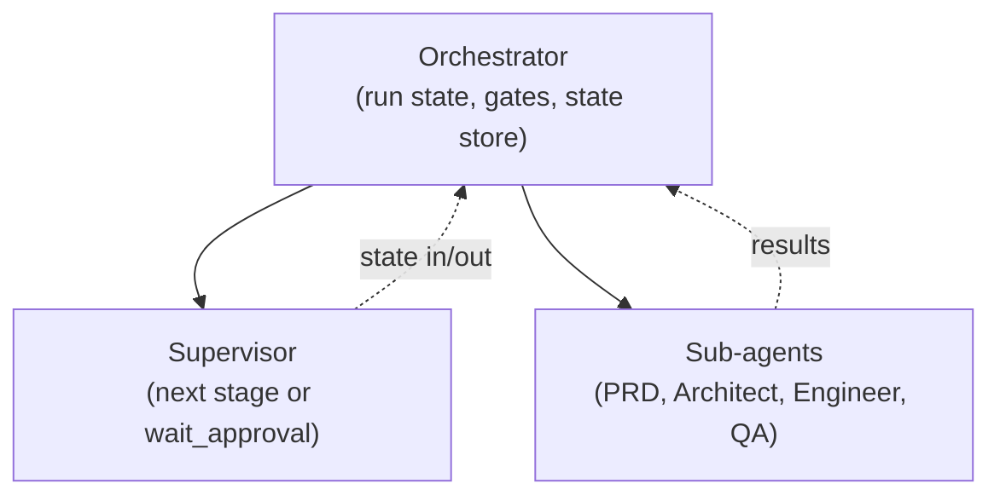

# Building Agents with Claude and OpenRouter — End-to-End Guide

A practical guide to building our agentic feature-onboarding workflow using the **Claude Agent SDK** with an **OpenRouter** API key, following **Anthropic’s** recommended patterns and best practices.

---

## Table of contents

1. [Goals and scope](#1-goals-and-scope)
2. [Anthropic / Claude best practices we follow](#2-anthropic--claude-best-practices-we-follow)
3. [Architecture: orchestrator, supervisor, sub-agents](#3-architecture-orchestrator-supervisor-sub-agents)
4. [OpenRouter + Claude Agent SDK setup](#4-openrouter--claude-agent-sdk-setup)
5. [Feature-onboarding pipeline (refined)](#5-feature-onboarding-pipeline-refined)
6. [Tool design (agent–computer interface)](#6-tool-design-agentcomputer-interface)
7. [Plugins, stack tooling, and top skills](#7-plugins-stack-tooling-and-top-skills)
8. [Prompts per stage](#8-prompts-per-stage)
9. [Human-in-the-loop and approval](#9-human-in-the-loop-and-approval)
10. [Sessions, isolation, and security](#10-sessions-isolation-and-security)
11. [Implementation checklist](#11-implementation-checklist)
12. [Reuse, scale, and how to run this](#12-reuse-scale-and-how-to-run-this)
13. [Docker and abstraction for reuse](#13-docker-and-abstraction-for-reuse)
14. [Workforce per role: complete requirements](#14-workforce-per-role-complete-requirements)
15. [Best practices consolidated](#15-best-practices-consolidated)
16. [References](#16-references)
    - [16.1 Evaluation: AWS Agent Squad](#161-evaluation-aws-agent-squad--should-we-use-it)
    - [16.2 Evaluation: pi-mono](#162-evaluation-pi-mono--should-we-use-it)

---

## 1. Goals and scope

**What we build**

- An **agentic feature-onboarding** process: from PRD to shipped feature, with clear stages and human approval where needed.
- **Agents** that use Claude (via OpenRouter) and follow Anthropic’s “Gather → Act → Verify” loop.
- **One API key:** OpenRouter only; no direct Anthropic key required.
- **Best practices:** Workflows vs agents, good tool design (ACI), human-in-the-loop, isolation, and audit.

**Out of scope for this doc**

- Full deployment (Kubernetes, scaling). Covered at a high level only.
- Non-Claude models (OpenRouter supports them; we focus on Claude + OpenRouter here).

---

## 2. Anthropic / Claude best practices we follow

These come from [Anthropic – Building effective agents](https://www.anthropic.com/engineering/building-effective-agents) and the [Claude Agent SDK](https://platform.claude.com/docs/en/agent-sdk/overview).

### 2.1 Workflows vs agents

| Concept | Meaning | We use it for |
|--------|--------|----------------|
| **Workflow** | Predefined steps and gates; LLM + tools orchestrated by code. | Top-level pipeline: PRD → Architect → Engineer → QA → Monitoring. Fixed stages and approval gates. |
| **Agent** | LLM decides what to do next; uses tools in a loop until done. | Within stages that need open-ended work: e.g. Engineer (code + test), QA (run E2E). |

We do **not** make the whole pipeline one big agent. We use a **workflow** for the process and **agents** inside selected stages. In our architecture the **orchestrator** runs the workflow; the **supervisor** (state machine or LLM) decides the next stage; **sub-agents** perform the work of each stage.

### 2.2 Start simple, add complexity only when needed

- Ship a **linear** pipeline first (PRD → Architect → Engineer → QA) with one or two approval gates.
- Add routing (e.g. “easy vs complex PRD”), parallelization, or evaluator-optimizer only if they clearly improve outcomes.

### 2.3 Three-phase agent loop (Gather → Act → Verify)

Each agent stage should:

1. **Gather context** – Load only what’s needed for this step (spec, file list, last error).
2. **Take action** – Call tools (Read, Edit, Bash, or custom tools).
3. **Verify work** – Check results (tests, lint, E2E) and decide: continue, retry, or finish.

The Claude Agent SDK runtime already encourages this loop; we keep prompts and tools aligned with it.

### 2.4 Agent–computer interface (ACI)

- **Tools are the agent’s UI.** Invest in clear names, descriptions, and parameter docs (like good docstrings for a junior dev).
- **Easy-to-use formats:** Prefer formats the model handles well (e.g. full file content over complex diffs when possible).
- **Poka-yoke:** Make mistakes hard (e.g. absolute paths, explicit env, clear boundaries between tools).
- **Test with the model:** Run many examples and fix naming/description issues.

### 2.5 Human-in-the-loop and risk

- **Risk-based approval:** Require human approval for high-impact steps (e.g. “spec approved”, “ship to prod”), not for every tool call.
- **Workflow-level gates:** Pause after a full stage (e.g. after PRD, after spec), show summary, then Approve / Reject / Add input.
- **Audit:** Record who approved what and when (in pipeline state or DB).

### 2.6 Isolation and session model

- **One execution environment per run** (e.g. one sandbox/container per feature run).
- **Ephemeral when possible:** Create for the run, destroy when done; persist only state and artifacts.
- **Credentials outside the agent boundary** where possible (e.g. inject via proxy or env managed by orchestrator).

---

## 3. Architecture: orchestrator, supervisor, sub-agents

We use a three-layer structure: **Orchestrator** (top) holds run state and gates and invokes the **Supervisor** and **Sub-agents**; the **Supervisor** (middle) decides which stage runs next or when to wait for approval; **Sub-agents** (bottom) do the work of each stage (PRD, Architect, Engineer, QA). This matches the same conceptual hierarchy as frameworks like [AWS Agent Squad](https://awslabs.github.io/agent-squad/general/introduction/) (orchestrator / classifier-or-supervisor / agents); our pipeline is **stage-based with shared run state and gates**, not per-message routing.

High-level shape:

```
┌─────────────────────────────────────────────────────────────────────────┐
│  ORCHESTRATOR                                                            │
│  Run state, state store, approval channel; calls Supervisor; invokes    │
│  Sub-agents; handles gates (interrupt → Slack → resume).                │
└─────────────────────────────────────────────────────────────────────────┘
    │
    ▼
┌─────────────────────────────────────────────────────────────────────────┐
│  SUPERVISOR (state machine or supervising agent)                         │
│  Input: run state + config. Output: run_stage(PRD|Architect|Engineer|QA)  │
│  or wait_approval(gate_id) or done.                                      │
└─────────────────────────────────────────────────────────────────────────┘
    │
    ▼
┌─────────────────────────────────────────────────────────────────────────┐
│  SUB-AGENTS (Claude Agent SDK per stage)                                │
│  PRD agent → Architect agent → Engineer agent → QA agent                │
│  Each: stage-specific prompt + tools; Gather–Act–Verify.                │
└─────────────────────────────────────────────────────────────────────────┘
    │
    └─► Monitoring: cron/worker (health checks, Slack/MCP on failure; no agent loop)
```



- **Orchestrator:** Holds run state, state store, and approval channel; calls the Supervisor to get the next action; invokes the appropriate Sub-agent (or handles a gate); persists state between stages.
- **Supervisor:** Decides the next action: `run_stage(PRD | Architect | Engineer | QA)` or `wait_approval(gate_id)` or `done`. Implemented as a **deterministic state machine** (default) or as a **supervising agent** (LLM that chooses the next step from run state). See §5.3.
- **Sub-agents:** PRD agent, Architect agent, Engineer agent, QA agent. Each is a Claude Agent SDK (or equivalent) run with OpenRouter; each gets the right system prompt and allowed tools for that stage.
- **Gates:** Workflow interrupts: post to Slack (or similar), wait for Approve/Reject, then resume with same run/thread.

---

## 4. OpenRouter + Claude Agent SDK setup

### 4.1 Prerequisites

- **OpenRouter API key:** [OpenRouter – API keys](https://openrouter.ai/settings/keys).
- **Node.js 18+** (for TypeScript SDK) or **Python 3.10+** (for Python SDK).

### 4.2 Use Claude Agent SDK with OpenRouter

The SDK talks to Anthropic’s API by default. To use **OpenRouter** with your key, set these **before** any agent process starts:

```bash
export ANTHROPIC_BASE_URL="https://openrouter.ai/api"
export ANTHROPIC_AUTH_TOKEN="$OPENROUTER_API_KEY"
export ANTHROPIC_API_KEY=""   # Must be explicitly empty so OpenRouter is used
```

Reference: [OpenRouter – Anthropic Agent SDK](https://openrouter.ai/docs/guides/community/anthropic-agent-sdk).

### 4.3 Install SDK

**TypeScript:**

```bash
npm install @anthropic-ai/claude-agent-sdk
```

**Python:**

```bash
pip install claude-agent-sdk
```

### 4.4 Optional: pin Claude model via OpenRouter

OpenRouter uses model IDs like `anthropic/claude-3.5-sonnet`. If the SDK respects Claude Code–style overrides, you can set for example:

```bash
export ANTHROPIC_DEFAULT_SONNET_MODEL="anthropic/claude-3.5-sonnet"
```

(Confirm variable names in [OpenRouter’s Claude Code integration](https://openrouter.ai/docs/guides/guides/claude-code-integration) if needed.)

### 4.5 Minimal “hello agent” (TypeScript)

```typescript
import { query } from "@anthropic-ai/claude-agent-sdk";

async function main() {
  for await (const message of query({
    prompt: "List the files in the current directory and summarize what this project does.",
    options: {
      allowedTools: ["Read", "Bash"],
    },
  })) {
    if (message.type === "assistant") {
      console.log(message.message.content);
    }
  }
}

main();
```

Run with the three env vars set; the agent will use OpenRouter for Claude.

---

## 5. Feature-onboarding pipeline (refined)

Requirements adjusted to match workflow + agents and approval best practices.

### 5.1 Stages (final)

| Stage | Type | Input | Output | Approval? |
|-------|------|--------|--------|-----------|
| **PRD** | Workflow or small agent | PRD doc / link | Summary, feasibility, clarification questions | Yes: “Approve PRD / Add answers” |
| **Architect** | Agent | Approved PRD + context | Technical spec (APIs, components, risks) | Yes: “Approve spec” |
| **Engineer** | Agent (Gather–Act–Verify) | Spec + repo/sandbox | Code + unit test results | Optional: “Review diff” |
| **QA** | Agent (Gather–Act–Verify) | Spec + branch/artifact | E2E results, pass/fail | Yes: “Ship to prod?” |
| **Monitoring** | Cron/worker | Shipped features list | Alerts on failure (Slack/MCP) | No |

### 5.2 State per run

Keep one state object per feature run (e.g. in DB or in workflow state):

- `run_id`, `thread_id` (for resume after approval)
- `prd_input`, `prd_summary`, `prd_questions`, `prd_approved`, `prd_answers`
- `tech_spec`, `spec_approved`
- **Worktree:** `worktree_path`, `feature_branch`, `base_branch` (for Engineer/QA and cleanup)
- `branch_name`, `files_changed`, `unit_test_results`, `e2e_results`
- **Design check (if UI):** `figma_file_key`, `figma_node_id` (or export URL); `design_check_result` (pass/fail, diff summary)
- **MCP / external refs (optional):** `jira_issue_key` or `jira_issue_url`; `notion_page_id` or `notion_prd_url`; `docs_urls[]` / `reference_urls[]` (URLs to fetch for docs and implementation context)
- `shipped_at`, `feature_id` (for monitoring)
- `approvals[]` (who, when, stage, decision)

### 5.3 Orchestrator, supervisor, and sub-agents

- **Orchestrator:** The top-level process that holds run state, talks to the state store and approval channel, calls the Supervisor to get the next action, invokes the corresponding Sub-agent (or handles a gate), and persists state between stages.
- **Supervisor:** The component that decides “what to do next.” It takes run state (and config) and returns the next action: run a stage (PRD, Architect, Engineer, QA), wait for approval at a gate, or mark the run done.
- **Sub-agents:** The stage workers — PRD agent, Architect agent, Engineer agent, QA agent. Each is a single Claude Agent SDK invocation (or equivalent) with stage-specific prompts and tools.

**Implementation options for the Supervisor**

- **Option A (recommended for v1): Deterministic state machine.** Fixed order PRD → Architect → Engineer → QA with gates after each; no LLM for stage selection. Predictable and auditable; the “supervisor” is just the state machine transition logic (e.g. “after PRD gate approved → run Architect”).
- **Option B (optional): Supervising agent.** One LLM call per step that receives run state (and optionally stage summaries) and returns `next_stage` or `wait_approval(gate_id)` or `done`. Enables dynamic retries, skip/retry stages, or future branching. Trade-off: more flexibility vs less predictability and extra cost; document which option is in use when deploying.

See the diagram in §3 for the three-layer flow.

### 5.4 Where Claude Agent SDK is used

- **PRD:** Optional. Can be a single LLM call or a tiny agent with “Read” and maybe “web search” if you expose it.
- **Architect:** One agent run: system prompt = “You are an architect. Produce a technical spec from this PRD.” Input = PRD + any clarifications. Output = spec (structured or markdown).
- **Engineer:** Agent with tools: Read, Edit, Bash (and custom if needed). System prompt = “Implement the following spec; run tests; report results.” Run in a dedicated sandbox (e.g. AIO Sandbox or SDK’s built-in environment).
- **QA:** Agent with tools: Bash, Read, **browser** (open app, interact, screenshot), and **Figma comparison** when the feature has UI. System prompt = “Run E2E; if UI, open browser and compare with Figma design.” Same or new sandbox.

Orchestrator starts each stage, waits for completion or interrupt, then either runs the next stage or pauses for approval and resumes after Slack callback.

### 5.5 GitHub worktree per run

Use a **Git worktree** so each feature run has an isolated working directory on its own branch, without touching `main` or other runs.

**Why worktrees**

- One run = one branch = one worktree path. No conflicts between concurrent runs.
- Engineer agent works in `worktrees/run-<run_id>/`; QA runs E2E against the same path; when done, you merge or discard the branch and remove the worktree.
- Aligns with “one sandbox per run” and ephemeral cleanup.

**How to wire it**

1. **Create worktree when starting Engineer stage:**  
   `git worktree add <worktree_path> -b feature/<run_id> <base_branch>`  
   e.g. `git worktree add /tmp/worktrees/run-abc123 -b feature/run-abc123 main`
2. **Point the sandbox (or SDK) workspace** at `worktree_path` so Read/Edit/Bash run there.
3. **QA** uses the same path (same worktree) for E2E and browser tests.
4. **On completion or teardown:**  
   - If shipped: merge `feature/<run_id>` into your target branch, then remove worktree.  
   - If rejected or abandoned: `git worktree remove <worktree_path>` (and optionally delete the branch).

**State to store:** `worktree_path`, `feature_branch` (e.g. `feature/run-abc123`), `base_branch` (e.g. `main`). Cleanup job should remove worktrees for runs that are done or expired.

**Reference:** [Git worktree documentation](https://git-scm.com/docs/git-worktree).

---

## 6. Tool design (agent–computer interface)

### 6.1 Built-in tools (Claude Agent SDK)

The SDK provides tools such as **Read**, **Edit**, **Bash**. Use the minimum set per stage:

- **PRD/Architect:** Read (and optional search).
- **Engineer:** Read, Edit, Bash (and custom “run tests” if you want a single high-level tool).
- **QA:** Read, Bash, **browser** (see below), and **Figma comparison** when the feature has UI.

### 6.2 Custom tools (if needed)

When adding custom tools (e.g. “run test suite”, “post to Slack”):

- **Name:** One clear verb or verb_noun (e.g. `run_unit_tests`, `notify_slack`).
- **Description:** 1–2 sentences: when to use it, what it does, what it returns.
- **Parameters:** Zod (or SDK equivalent) with short descriptions; use absolute paths or explicit env when possible.
- **Output:** Structured and short when possible (e.g. `{ passed: boolean, summary: string }`); truncate long logs before putting in context.

### 6.3 Sandbox (AIO or SDK default)

- **Engineer and QA** should run inside one sandbox per run (ephemeral).
- If using **AIO Sandbox:** Wire its capabilities (shell, file, browser) as the environment the SDK’s Bash/Read/Edit run in, or expose them as custom tools that the agent calls.
- Keep **credentials** (API keys, tokens) outside the sandbox; inject via env or a proxy used by the orchestrator.

### 6.4 Open browser to test features (E2E)

When the feature has a UI, QA should **open a real browser** in the sandbox, load the app (e.g. dev server or preview URL), and exercise flows (click, type, navigate). Prefer doing this inside the same sandbox so the filesystem and server are consistent.

**Options**

- **AIO Sandbox:** Use the built-in browser (CDP/Playwright) and expose a tool like `browser_navigate`, `browser_click`, `browser_screenshot` so the QA agent can drive it.
- **Claude Agent SDK / Playwright:** If the SDK or your custom tools support it, run Playwright (or similar) inside the sandbox and return screenshots or pass/fail results to the agent.
- **Custom tool:** e.g. `run_e2e_browser({ url, steps })` that runs a small script in the sandbox, opens the browser, runs the steps, and returns a short summary and screenshot path.

**Agent prompt:** “If this feature includes UI, start the app (if needed), open the browser to the given URL, perform the key user flows from the spec, take a screenshot, and report any visible errors or mismatches.”

### 6.5 UI: compare with Figma (design vs implementation)

When a Figma design exists for the feature, add a **design compliance** step so the agent (or a dedicated tool) can compare the implemented UI to the design.

**Options**

- **Screenshot vs Figma export:** In QA, after the browser screenshot is taken, call a tool that (1) fetches the relevant Figma frame/component (via Figma API or a static export URL), and (2) compares it to the screenshot (pixel diff, or LLM-based “does this match the design?”). Return a short report: match / minor differences / major differences, plus a list of discrepancies.
- **Figma API:** Use [Figma REST API](https://www.figma.com/developers/api) (with a token in env, outside the sandbox) to get node tree or export images for the design. Orchestrator or a custom tool can pass “design image” and “implementation screenshot” to the agent or a comparison script.
- **Agent prompt:** “Compare the implementation screenshot to the Figma design (or design image provided). List any layout, color, or copy differences. If they are within acceptable tolerance, report design check passed; otherwise list required fixes.”

**What to store:** `figma_file_key`, `figma_node_id` (or export URL) in pipeline state when the feature has a design; QA stage reads these and runs the comparison. Store comparison result (pass/fail, diff summary) in state and optionally attach diff image to the approval message in Slack.

**Reference:** [Figma API](https://www.figma.com/developers/api); your org’s Figma MCP or integration if available.

### 6.6 MCP integrations: Figma, Jira, Notion, and web/docs

Provide **MCP (Model Context Protocol) servers** so agents can read from Figma, Jira, Notion, and from the web (fetch URLs, scrape docs) in each workflow stage where it helps. Wire the same MCP tools into the orchestrator or agent runtime so they are available when the run config includes the relevant IDs or URLs.

#### Which MCP in which stage

| Stage | Figma | Jira | Notion | Web / docs scrape |
|-------|--------|------|--------|--------------------|
| **PRD** | Optional (if PRD links design) | Yes: fetch issue/ticket for context, acceptance criteria | Yes: fetch PRD or spec from Notion page | Yes: fetch URL(s) for linked docs or references |
| **Architect** | Optional: get frame/node IDs for spec | Yes: link spec to Jira; read acceptance criteria | Yes: read existing specs or ADRs | Yes: pull implementation guides, API docs from URLs |
| **Engineer** | Optional (reference only) | Optional: update ticket or read AC | Optional: read implementation notes | Yes: fetch official docs, examples, SDK docs by URL |
| **QA** | Yes: compare implementation to design | Optional: verify against acceptance criteria, update status | Optional: read test checklist | Yes: fetch expected behavior from docs if needed |

#### Figma MCP

- **Purpose:** Fetch file metadata, node tree, or export images so the agent can compare implementation to design (see §6.5). Also useful in Architect to “see” the design when writing the spec.
- **When:** Pass `figma_file_key` and optionally `figma_node_id` in run config or pipeline state. PRD/Architect can use it if the PRD links a Figma file; QA uses it for design check.
- **Credentials:** Figma API token in env; orchestrator or MCP server uses it. Do not expose token to the sandbox.
- **Tools (typical):** e.g. `figma_get_file`, `figma_get_node`, `figma_export_image`. Expose only what the agent needs (read-only for this workflow).

#### Jira MCP

- **Purpose:** Fetch issue/ticket (title, description, acceptance criteria, status); optionally update status or add a comment when a stage completes (e.g. “Spec approved”, “In QA”).
- **When:** If the run is tied to a Jira issue (e.g. `jira_issue_key` or `jira_issue_url` in run config), PRD and Architect **fetch the issue** at the start of the stage and use it as input. QA can **verify** that implementation meets acceptance criteria from Jira; optional: post result or update status.
- **Credentials:** Jira API token or OAuth; stored in env or secret manager; used by the MCP server or orchestrator, not inside the sandbox.
- **Tools (typical):** e.g. `jira_get_issue`, `jira_get_acceptance_criteria`, `jira_add_comment`, `jira_transition`. Restrict to read-only for PRD/Architect/QA unless you explicitly want the agent to transition issues.

#### Notion MCP

- **Purpose:** Fetch PRD, spec, or runbook from a Notion page so the agent has the latest doc without pasting. Useful when PRD or specs live in Notion.
- **When:** If run config has `notion_page_id` or `notion_prd_url`, PRD stage **fetches the page** and uses it as `prd_text`. Architect can fetch related pages (e.g. ADRs, existing specs). Engineer/QA can fetch implementation or test checklists if stored in Notion.
- **Credentials:** Notion integration token in env; MCP server uses it.
- **Tools (typical):** e.g. `notion_get_page`, `notion_search`, `notion_get_blocks`. Read-only for this workflow unless you need the agent to write back.

#### Web / docs scrape (check websites, fetch docs)

- **Purpose:** Let the agent **fetch a URL** (or a list of URLs) and use the content for context: official docs, implementation guides, API references, or internal wikis. Use for “check the website”, “scrape for docs”, and “implementation details” when the PRD or spec references external links.
- **When:** Run config can include `docs_urls[]` or `reference_urls[]`. PRD: fetch linked docs to validate or summarize. Architect: fetch API docs, framework guides. Engineer: fetch SDK docs, code examples, migration guides. QA: fetch expected behavior or public specs if relevant.
- **Implementation options:**
  - **MCP server:** A “web” or “fetch” MCP that exposes e.g. `fetch_url(url)` or `fetch_and_extract(url)` (returns cleaned text or markdown). Optionally rate-limit and restrict to allowlisted domains.
  - **Tool in orchestrator:** Custom tool that fetches the URL (server-side), strips HTML to text/markdown, truncates to a max length, and returns to the agent. Reduces prompt injection risk vs giving the agent raw HTML.
- **Safety:** Allowlist domains (e.g. your docs, notion, known SDK docs). Do not fetch arbitrary user-supplied URLs without validation. Prefer server-side fetch so the sandbox never does outbound HTTP to unknown hosts.
- **Tools (typical):** e.g. `web_fetch(url)`, `web_fetch_markdown(url)`, `docs_search(query, base_url)` if you have a docs index.

#### Run config and state for MCP

Add to **run config** (and pipeline state) so the orchestrator knows what to pass to each stage:

- `figma_file_key`, `figma_node_id` (optional)
- `jira_issue_key` or `jira_issue_url` (optional)
- `notion_page_id` or `notion_prd_url` (optional); `notion_spec_page_id` (optional)
- `docs_urls[]` or `reference_urls[]` (optional): list of URLs the agent may fetch for this run

Orchestrator injects these into the user prompt or context for each stage (e.g. “Jira issue: PROJ-123 (use Jira MCP to fetch). Notion PRD: <page_id>. Reference URLs: …”). Agents use the MCP tools when the run config includes the corresponding IDs/URLs.

#### Wiring MCP into the workflow

- **Claude Agent SDK / runtime:** Configure the agent to use your MCP servers (Figma, Jira, Notion, web) so the tools appear alongside Read, Edit, Bash. Use the same MCP config for all runs; enable/disable or pass parameters per run via run config.
- **Per-stage tool allowlist:** Restrict which tools each stage can call (e.g. PRD: Read + Jira + Notion + web_fetch; Engineer: Read, Edit, Bash + web_fetch; QA: Read, Bash, browser, Figma + optional Jira). Reduces misuse and keeps stages focused.

---

## 7. Plugins, stack tooling, and top skills

### 7.1 Plugins and tooling for our stack (Next, Nest, Postgres, Java)

Use these so the Engineer and QA agents run in an environment that matches your stack and so tools (lint, test, DB) work out of the box.

| Stack | What to add | Why it helps the workflow |
|-------|-------------|---------------------------|
| **Next.js** | `next` CLI in sandbox; ESLint + Next config (`eslint-config-next`); `npm run build` / `npm run lint` / `npm run test`. Optional: MCP or custom tool that runs `next dev` and returns preview URL for QA. | Agent can build, lint, and test Next apps; QA can hit the dev server. |
| **NestJS** | `@nestjs/cli`; Jest (default); `npm run build`, `npm run test`, `npm run test:e2e`. Optional: Swagger/OpenAPI so Architect or Engineer can read API shape. | Agent generates modules/controllers; runs unit and E2E tests; follows Nest structure. |
| **Postgres** | DB in sandbox or shared dev DB; migrations (e.g. Prisma, TypeORM, or Flyway). Tool or script: run migrations, optionally seed. **Do not** give agent prod DB credentials. | Engineer can add migrations; QA can verify against a known schema. |
| **Java** | Maven or Gradle in sandbox; Checkstyle/Spotless or Google Java Format; JUnit 5. Commands: `./mvnw test`, `./mvnw verify`, or `./gradlew test`. | Agent can compile, test, and format Java; same commands humans use. |

**Recommended “plugins” (integrations) for the pipeline**

- **ESLint / Prettier (TS/JS):** Run in Engineer stage before “done”; agent fixes lint errors so approval sees clean diff.
- **Prisma / TypeORM / Drizzle:** If you use an ORM, expose schema and migration commands to the agent; consider a small custom tool “run_migration” that runs only in sandbox and returns success/failure.
- **Playwright or Cypress:** For E2E, install in the repo (or sandbox image) so QA agent runs `npx playwright test` or equivalent; reports go back into state.
- **Figma plugin or MCP:** If your org uses Figma MCP (or Figma API wrapper), wire it so the QA stage can fetch design frames for comparison without hardcoding tokens in the agent.

**Sandbox image:** Prefer a Docker image that already has Node 20+, pnpm/npm, Java 17+ (if needed), Postgres client, and your monorepo’s root so `npm install` and `npm run build` work. Reduces Engineer agent time and failures.

### 7.2 Top skills for our use case

“Skills” here means: capabilities or habits we give the agents (via tools, prompts, or conventions) so feature-onboarding stays consistent and high quality.

| Skill | How we give it to the agent | Stage(s) |
|-------|-----------------------------|----------|
| **Read the codebase first** | System prompt: “Before implementing, read the relevant existing files (structure, patterns, exports). Match existing style and conventions.” | Engineer |
| **Follow our conventions** | Provide a short “conventions” doc or list in context (e.g. “We use Nest modules; API routes under `src/modules/<name>`; tests next to source”). Refer to it in the Engineer prompt. | Architect, Engineer |
| **Run tests after every change** | Prompt: “After editing code, run the relevant tests. If they fail, fix before reporting done.” Tool: `run_tests` or Bash with `npm run test`. | Engineer |
| **Use absolute paths** | Tool descriptions and prompt: “Use absolute paths from repo root (e.g. `src/modules/auth/auth.service.ts`). Do not rely on relative paths from cwd.” | Engineer, QA |
| **One logical change per file** | Prompt: “Prefer one clear change per file. Do not mix unrelated edits.” | Engineer |
| **E2E covers happy path + one failure path** | QA prompt: “Run at least: main happy path from spec; one failure or edge case (e.g. validation error). Report both.” | QA |
| **Design check only when Figma is provided** | QA prompt: “If `figma_file_key` or design URL is in context, run the design comparison and report. Otherwise skip design check.” | QA |
| **Summarize for humans** | PRD and Architect outputs: “End with a short summary (3–5 bullets) and, if needed, a list of open questions or risks.” | PRD, Architect |
| **No secrets in code** | Prompt: “Do not write API keys, passwords, or tokens in code. Use env vars or placeholders.” Conventions doc: “Secrets come from env.” | Engineer |

Add these to your **run config** or **conventions file** so every run gets the same skills; tune per repo if you have multiple products.

---

## 8. Prompts per stage

Use these as **system prompts** (and optional **user-prompt templates**) for each stage so each bot behaves consistently. Inject run-specific values (e.g. `{{prd_text}}`, `{{spec}}`) from pipeline state.

### 8.1 PRD / Researcher

**System prompt:**

```
You are a product-minded technical reviewer. Your job is to validate a product requirements document (PRD) and assess feasibility for engineering.

- If a **Jira issue key or URL** is provided, use the Jira tool to fetch the issue (title, description, acceptance criteria) and treat it as part of the PRD input.
- If a **Notion page ID or URL** is provided, use the Notion tool to fetch the page content and treat it as the PRD (or as additional context).
- If **reference URLs** (docs, websites) are provided, use the web fetch tool to retrieve and summarize relevant content that affects feasibility.
- Summarize the PRD in 3–5 bullets: goal, scope, and main user flows.
- List technical risks or dependencies (e.g. new integrations, data model changes, performance).
- List up to 5 clarification questions that, if answered, would unblock or improve the technical spec. Be specific (e.g. “What is the expected max concurrency for this API?”).
- End with a one-line feasibility verdict: FEASIBLE / FEASIBLE WITH CAVEATS / NEEDS CLARIFICATION.

Do not propose solutions yet. Only validate, summarize, and ask questions. Output in markdown.
```

**User prompt template:**  
`Validate this PRD and output your summary, risks, questions, and verdict. If jira_issue_key is provided, fetch that Jira issue first. If notion_page_id is provided, fetch that Notion page. If docs_urls are provided, fetch those URLs. Then:\n\n{{prd_text}}`

---

### 8.2 Architect

**System prompt:**

```
You are a senior software architect. Your job is to produce a technical specification from an approved PRD.

- If a **Jira issue key** is provided, use the Jira tool to fetch acceptance criteria and link the spec to the ticket.
- If **Notion** page(s) are provided (e.g. existing specs, ADRs), use the Notion tool to read them and align the new spec with existing patterns.
- If **reference URLs** (API docs, implementation guides) are provided, use the web fetch tool to pull in relevant details for APIs, frameworks, or constraints.
- If **Figma** file/key is provided, use the Figma tool to get frame or node IDs and reference them in the spec for the QA design check.

Tech stack context: We use Next.js (frontend), NestJS (backend APIs), Postgres (database), and sometimes Java services. Prefer TypeScript/Node unless the PRD explicitly requires Java.

Output a structured spec in markdown with:

1. **Overview** – 2–3 sentences on what we’re building and how it fits the system.
2. **Data / API** – New or changed entities, API endpoints (method, path, request/response shape), and DB migrations if needed.
3. **Components / Modules** – For Next: pages, components, hooks. For Nest: modules, controllers, services. For Java: packages and main classes.
4. **Key flows** – Step-by-step for the main user or system flows (e.g. “User submits form → API validates → DB write → event emitted”).
5. **Risks and mitigations** – Short list.
6. **Open points** – Anything that still needs product or tech lead input.

Match our existing patterns: same folder structure, naming, and style as the rest of the codebase. If the PRD references Figma, note the screen/frame IDs for the QA design check.
```

**User prompt template:**  
`Produce the technical spec for this feature. PRD summary and clarifications:\n\n{{prd_summary}}\n\nApproved answers:\n{{prd_answers}}\n\n(Optional) Relevant repo structure or file list:\n{{repo_context}}`

---

### 8.3 Engineer

**System prompt:**

```
You are a senior engineer implementing a feature from an approved technical spec. You work in a sandbox with Read, Edit, and Bash (and any custom tools provided).

Rules:
- **Gather first:** Read the spec and the relevant existing files. Understand structure, patterns, and exports before editing.
- If **reference URLs** (official docs, SDK docs, migration guides) are provided, use the web fetch tool to pull implementation details or examples and follow them. Do not guess API shapes when docs are available.
- **Conventions:** Follow the repo’s existing style (Nest modules, Next app router, Prisma/TypeORM patterns). Use absolute paths from repo root.
- **One change per file:** Prefer focused edits. Do not mix unrelated changes.
- **Test after each logical step:** Run the relevant unit tests (e.g. npm run test or ./mvnw test). If tests fail, fix before continuing. Do not report “done” with failing tests.
- **No secrets:** Do not write API keys, passwords, or tokens in code. Use environment variables or placeholders.
- **Verify:** Before finishing, run the full test suite (and lint if available). Summarize what you implemented and the test result (pass/fail, count).

Stack: Next.js, NestJS, Postgres, and sometimes Java. Use the same tools and commands the team uses (npm/pnpm, Maven/Gradle). If the spec mentions migrations, run them in the sandbox only.
```

**User prompt template:**  
`Implement the following technical spec. Work in the repo at {{worktree_path}}. Run tests and lint; report when done.\n\n## Spec\n\n{{tech_spec}}`

---

### 8.4 QA

**System prompt:**

```
You are a QA engineer validating a feature implementation against the technical spec and, when provided, the Figma design.

Steps:
1. **Gather:** Read the spec and the implementation (key files or diff). Identify the main user flows and any UI screens. If a **Jira issue** is provided, use the Jira tool to fetch acceptance criteria and verify the implementation against them. If **reference URLs** are provided, fetch them to confirm expected behavior.
2. **Unit / integration:** Run the project’s test suite (e.g. npm run test, npm run test:e2e, or equivalent). Report pass/fail and any failure summary.
3. **E2E in browser:** If the feature has a UI, start the app (e.g. npm run dev), open the browser to the given URL, and execute the main flows from the spec. Take a screenshot. Report any console errors, broken elements, or wrong behavior.
4. **Design check:** If a Figma file/key or design image is provided, use the **Figma** tool to fetch the design and compare the implementation screenshot to it. List layout, color, or copy differences. State: DESIGN CHECK PASSED / MINOR DIFFERENCES / FAILED (with list of fixes).
5. **Summary:** Output a short report: Test results (unit + E2E), browser check (pass/fail), design check (if applicable), Jira AC check (if applicable), and overall READY TO SHIP / NOT READY with reasons.

Use the tools you have: Bash, Read, browser (navigate, click, screenshot), Figma (when design is provided), Jira (when issue key is provided), and web fetch (when reference URLs are provided). Be concise; no need to repeat the full spec.
```

**User prompt template:**  
`Validate this feature. Spec:\n\n{{tech_spec}}\n\nImplementation is in {{worktree_path}}. App URL (if UI): {{app_url}}. If jira_issue_key provided, fetch Jira AC and verify. If figma_file_key provided, run Figma design check. If docs_urls provided, fetch to confirm expectations. Run tests, E2E, and design check; then output your report.`

---

### 8.5 Prompt maintenance

- Keep prompts in versioned files (e.g. `prompts/prd_system.md`, `prompts/engineer_system.md`) or in config so you can diff and tune without code changes.
- Use placeholders (`{{variable}}`) and fill them from pipeline state when invoking each stage.
- If a stage often drifts (e.g. Engineer skips tests), tighten the relevant bullet in the system prompt and add one example in the user prompt (e.g. “Example: after adding AuthService, run npm run test -- auth”).

---

## 9. Human-in-the-loop and approval

### 9.1 Approval points

- **After PRD:** Interrupt with summary + questions. Resume with `{ approved: true, answers?: {...} }`.
- **After Architect:** Interrupt with spec summary/link. Resume with `{ approved: true }` or `{ approved: false, feedback: "..." }`.
- **After QA (optional):** “E2E passed. Ship? Approve / Reject.” Resume with ship decision.

### 9.2 Implementation pattern

- Orchestrator runs the agent for a stage.
- When the stage finishes, orchestrator **does not** call the next stage immediately; it **interrupts** and persists state (e.g. LangGraph `interrupt()`, or your own “pause and store run_id/thread_id”).
- Orchestrator sends to **Slack** (or similar): message with run_id, thread_id, stage name, summary, and actions (e.g. Approve / Reject buttons with payload).
- When user acts, Slack (or webhook) calls your **backend** with run_id, thread_id, and decision.
- Backend **resumes** the workflow with the same thread_id and the approval payload so the next stage runs (or the pipeline records rejection and stops).

### 9.3 Audit

- Append to `approvals[]`: `{ stage, approved, by, at, payload }`.
- Store in the same place as pipeline state (DB or workflow store).

---

## 10. Sessions, isolation, and security

### 10.1 Session model

- **One run = one logical session:** one `run_id`, one `thread_id`, one sandbox (if used), one state object.
- **Ephemeral:** When the run is done (or TTL), destroy the sandbox; keep only state and artifacts (logs, test results, links).
- **Long-running optional:** If you add a “support” or “monitoring” agent that stays up, use a separate long-running session and resource limits.

### 10.2 Isolation

- **Sandbox per run** for Engineer and QA so code and tests don’t affect other runs or the host.
- **Network:** Restrict outbound calls where possible (e.g. allow only OpenRouter, your APIs, and Slack).
- **Filesystem:** Agent can see only workspace/repo and temp dirs; no access to secrets or other tenants’ data.

### 10.3 Credentials

- **OpenRouter key:** In env (e.g. `OPENROUTER_API_KEY`), not in code or in agent-visible storage.
- **Slack / MCP:** Tokens and webhook secrets in env or secret manager; only the orchestrator/backend uses them, not the agent’s sandbox.

### 10.4 Security checklist

- [ ] OpenRouter key only in env (or secret manager).
- [ ] One sandbox per run; tear down when done.
- [ ] Approval webhook verifies signature or token before resuming.
- [ ] Audit log for approvals and critical actions.
- [ ] No secrets in agent-visible files or prompts.

---

## 11. Implementation checklist

Use this as a sequential checklist.

### Phase 1: Foundation

- [ ] Get OpenRouter API key; set `ANTHROPIC_BASE_URL`, `ANTHROPIC_AUTH_TOKEN`, `ANTHROPIC_API_KEY=""`.
- [ ] Install Claude Agent SDK (TypeScript or Python); run minimal “hello agent” with Read/Bash.
- [ ] Confirm agent uses OpenRouter (e.g. check OpenRouter usage/dashboard).

### Phase 2: Single-stage agent

- [ ] Use **Architect** system and user prompts from [§8.2](#82-architect) (or adapt to your stack).
- [ ] Implement **Architect** stage: one agent run, input = PRD text + optional repo context, output = spec.
- [ ] Store spec in pipeline state (file or DB).

### Phase 3: Multi-stage workflow

- [ ] Add **orchestrator** (state machine or LangGraph): PRD → Architect → (later: Engineer, QA).
- [ ] Implement **PRD** stage using prompts from [§8.1](#81-prd--researcher); output summary + questions; store in state.
- [ ] Add **interrupt** after PRD and after Architect (or equivalent “pause and wait for webhook”).

### Phase 4: Human-in-the-loop and MCP

- [ ] **MCP:** Wire Figma, Jira, Notion, and web/docs MCP servers (or equivalent tools) per [§6.6](#66-mcp-integrations-figma-jira-notion-and-webdocs). Add `jira_issue_key`, `notion_page_id`, `docs_urls` to run config and pipeline state.
- [ ] Implement Slack (or similar) notification on interrupt: run_id, thread_id, stage, summary.
- [ ] Implement webhook: receive Approve/Reject, resume workflow with same thread_id and payload.
- [ ] Append approvals to audit log.

### Phase 5: Engineer and QA agents

- [ ] **Stack tooling:** Add plugins/tooling for your stack per [§7.1](#71-plugins-and-tooling-for-our-stack-next-nest-postgres-java) (Next, Nest, Postgres, Java); ensure sandbox has correct runtimes and commands.
- [ ] **Skills:** Add top skills from [§7.2](#72-top-skills-for-our-use-case) to run config or conventions (e.g. “read codebase first”, “run tests after change”, “no secrets in code”).
- [ ] **Git worktree:** Create one worktree per run (branch `feature/<run_id>`) before Engineer; point sandbox/workspace at worktree path; remove worktree on teardown or after merge.
- [ ] Provision **sandbox** per run (AIO Sandbox or SDK default); pass to Engineer/QA; use worktree path as workspace.
- [ ] **Engineer** agent: Read, Edit, Bash; use **system and user prompts** from [§8.3](#83-engineer); run in sandbox.
- [ ] **QA** agent: Bash + **browser**; use **system and user prompts** from [§8.4](#84-qa); run in sandbox.
- [ ] **Figma comparison:** If feature has UI and Figma design, add tool or step: compare implementation screenshot to Figma (API or export); store design-check result in state; include in approval message if relevant.
- [ ] Optional: “Review diff” gate after Engineer; “Ship?” gate after QA.

### Phase 6: Monitoring and cleanup

- [ ] **Monitoring** job: list shipped features; for each, run health check/smoke test; on failure, post to Slack/MCP.
- [ ] **Teardown:** On run completion (or TTL), destroy sandbox and retain only state and artifacts.

### Phase 7: Hardening and reuse

- [ ] **Workforce completeness:** Verify each role (PRD, Architect, Engineer, QA) has all inputs, tools, skills, and prompts per [§14](#14-workforce-per-role-complete-requirements). Fix any missing tool or config.
- [ ] **Docker / abstraction:** If reusing across envs or teams, containerize orchestrator and sandbox; make pipeline config-driven and use abstract interfaces per [§13](#13-docker-and-abstraction-for-reuse).
- [ ] **Prompts:** Store prompts in versioned files (e.g. `prompts/*.md`); use placeholders from pipeline state; tune per stage if needed ([§8.5](#85-prompt-maintenance)).
- [ ] **Best practices:** Run through [§15](#15-best-practices-consolidated) (do/don’t/optional); fix any gaps.
- [ ] Tool descriptions and parameters reviewed and tested with the model (ACI).
- [ ] Error handling: timeouts, max steps, and clear failure messages.
- [ ] Security review: no secrets in logs or agent context; approval webhook verified.

---

## 12. Reuse, scale, and how to run this

### 12.1 How to run a single feature run (one-off)

1. **Prepare:** OpenRouter key in env; orchestrator and Claude Agent SDK installed; (optional) AIO Sandbox running or SDK default env.
2. **Start run:** Create `run_id`, `thread_id`; submit PRD (text or link). Orchestrator runs PRD stage.
3. **Approve:** When interrupted, open Slack (or your channel), review summary/questions, click Approve or add answers; workflow resumes.
4. **Repeat** for each gate (spec, ship). When QA passes and you approve “Ship”, orchestrator marks feature shipped and can merge the worktree branch (if used) and run cleanup.
5. **Teardown:** Remove worktree, destroy sandbox, keep state and artifacts (logs, screenshots, approval history).

### 12.2 Reuse: templates and run config

- **Pipeline template:** Store a default pipeline config (stages, which gates, which tools per stage) in code or a config file. New “feature onboarding” runs use this template; override only run-specific inputs (PRD, Figma link, base branch).
- **Run config file:** For each run you can optionally pass a small config: `base_branch`, `figma_file_key`, `slack_channel`, `max_engineer_steps`. Orchestrator reads it and injects into state so agents and tools behave consistently.
- **Reuse across repos:** Same orchestrator and agent prompts can target different repos by passing `repo_url` and `worktree_path` (or clone path). One pipeline codebase, many products.

### 12.3 Scale: multiple concurrent runs and team use

- **Concurrent runs:** Each run has its own `run_id`, `thread_id`, worktree, and sandbox. Run the orchestrator in a way that can start multiple runs (e.g. queue or multiple workers). Limit concurrency by max worktrees or max sandboxes to avoid resource exhaustion.
- **Worktree pool:** Use a dedicated directory for worktrees (e.g. `/data/worktrees`) and a naming convention `run-<run_id>`. Cleanup job periodically removes worktrees for completed or expired runs.
- **Sandbox pool:** If using AIO Sandbox (or similar), provision a pool of sandboxes or spin one up per run; release or destroy when the run finishes. Track “sandbox_id” or “sandbox_url” in run state.
- **Team use:** Share the same orchestrator and Slack workspace. Use different channels or tags per team/product so approval messages are routed correctly. Audit log should include “who approved” for accountability.
- **Rate limits:** OpenRouter and your own APIs may have rate limits. For many concurrent runs, consider per-run or global throttling and backoff so agents don’t hit limits and fail noisily.

### 12.4 Operational checklist for “run this in production”

- [ ] OpenRouter key (and Figma token if used) in secret manager; injected as env for orchestrator only.
- [ ] Orchestrator runs as a service (e.g. systemd, Docker, or K8s); restarts on failure; logs to a central place.
- [ ] Worktree base path and max worktrees configured; cleanup cron or job removes old worktrees.
- [ ] Sandbox lifecycle: create on run start, destroy on run end or TTL; no long-lived sandboxes for one-off runs.
- [ ] Slack (or approval channel) webhook URL and verification configured; only verified callbacks resume runs.
- [ ] Monitoring job runs on a schedule; posts to Slack/MCP on failure; list of “shipped features” updated when runs are marked shipped.
- [ ] Run state and audit log stored in a durable store (DB or object store); queryable for “run history” and “who approved what”.

---

## 13. Docker and abstraction for reuse

To make the workforce **reusable** across environments and teams, containerize and drive behavior from **config** so the same image can run anywhere with different prompts, MCP endpoints, and repos.

### 13.1 What to dockerize

| Component | Purpose | Image contents |
|-----------|---------|----------------|
| **Orchestrator** | Runs the pipeline (state machine or LangGraph), invokes agents per stage, handles interrupts and webhooks. | Runtime (Node/Python), Claude Agent SDK, orchestrator code, default config schema. No secrets in image. |
| **Sandbox (execution env)** | Where Engineer and QA run (Read, Edit, Bash, browser). | Use [AIO Sandbox](https://github.com/agent-infra/sandbox) image as-is, or your own image with Node 20+, pnpm, Java 17+ (if needed), Postgres client, Playwright. One container per run or pool. |
| **Optional: workforce bundle** | Single deployable that runs orchestrator + (optionally) sidecar MCP servers or points to external MCP. | Orchestrator image + Docker Compose (or K8s manifest) that wires orchestrator, sandbox pool or “create on demand”, and env for MCP URLs / API keys. |

### 13.2 Config-driven pipeline (abstract and reuse)

Keep the pipeline **fully config-driven** so one codebase serves all use cases:

- **Pipeline config (YAML/JSON):** Stages (PRD, Architect, Engineer, QA), order, which stages have approval gates, timeouts, max steps per stage.
- **Run config (per run):** `run_id`, `prd_input`, `jira_issue_key`, `notion_page_id`, `docs_urls[]`, `figma_file_key`, `base_branch`, `repo_url`, `slack_channel`, etc. Orchestrator reads this and passes to each stage.
- **Prompts:** Load system and user prompts from **files** (e.g. `prompts/prd_system.md`) or from config (embedded or URL). Use placeholders; orchestrator fills from pipeline state. Lets you change prompts without rebuilding the image.
- **Tool allowlist per stage:** In config, e.g. `prd: [Read, Jira, Notion, web_fetch]`; `engineer: [Read, Edit, Bash, web_fetch]`; `qa: [Read, Bash, browser, Figma, Jira, web_fetch]`. Orchestrator passes the right list to the SDK per stage.
- **MCP endpoints:** MCP server URLs (or “use stdio”) in env or config so the same image can talk to your Figma/Jira/Notion/web MCP servers in dev vs prod.

**Result:** One orchestrator image + one sandbox image; different configs for different repos or teams. No code change for “add a new stage” or “change PRD prompt”—only config/prompt files.

### 13.3 Abstract interfaces (swap implementations)

Define small interfaces so you can swap implementations without changing the pipeline logic:

| Interface | Responsibility | Implementations |
|-----------|----------------|-----------------|
| **SandboxProvider** | Create/destroy a workspace for a run; return `worktree_path` or `sandbox_url`. | AIO Sandbox API, local worktree-only, Docker run per run, K8s job. |
| **StateStore** | Persist and load pipeline state (run_id, thread_id, stage outputs, approvals). | Postgres, Redis, file-based, in-memory (dev). |
| **ApprovalChannel** | On interrupt: send message (run_id, stage, summary, actions). On approve: call backend with payload. | Slack, email + webhook, custom dashboard that calls resume API. |
| **MCP / ToolProvider** | Expose tools to the agent (Figma, Jira, Notion, web_fetch). | Real MCP servers (HTTP or stdio), or orchestrator-in-process tools that call the same APIs. |

Orchestrator depends on these interfaces; you inject the concrete implementation at startup (env or config). Same image runs with “Slack + Postgres + AIO Sandbox” in prod and “file state + local worktree” in dev.

### 13.4 Example: Docker Compose for local reuse

```yaml
# docker-compose.yml (example)
services:
  orchestrator:
    image: your-registry/feature-onboarding-orchestrator:latest
    environment:
      OPENROUTER_API_KEY: ${OPENROUTER_API_KEY}
      ANTHROPIC_BASE_URL: https://openrouter.ai/api
      ANTHROPIC_AUTH_TOKEN: ${OPENROUTER_API_KEY}
      STATE_STORE_URL: postgresql://...
      SLACK_WEBHOOK_URL: ${SLACK_WEBHOOK_URL}
      SANDBOX_PROVIDER_URL: http://sandbox:8080   # or AIO Sandbox
      PROMPTS_DIR: /app/prompts
    volumes:
      - ./config/pipeline.yaml:/app/config/pipeline.yaml
      - ./prompts:/app/prompts
    ports:
      - "3000:3000"

  sandbox:
    image: ghcr.io/agent-infra/sandbox:latest
    # ... (AIO Sandbox config; one per run or pool)
```

Run with `docker compose up`; orchestrator reads `pipeline.yaml` and `prompts/` from mounted volumes. Change config or prompts and restart—no rebuild.

### 13.5 Reuse checklist

- [ ] Orchestrator and sandbox (or sandbox provider) are containerized; no secrets in images.
- [ ] Pipeline and run config are external (file or env); prompts loaded from files or config.
- [ ] State store, approval channel, and sandbox provider are abstract; at least two implementations (e.g. dev vs prod) or documented interface for future swap.
- [ ] One set of images can run for multiple repos/teams by changing only config and run inputs.

---

## 14. Workforce per role: complete requirements

Each role (PRD, Architect, Engineer, QA) is a **self-contained workforce unit**: given the right inputs, tools, and prompts, it has everything it needs. Use this as the single source of truth for “what does each role need” and “is this workforce ready?”

### 14.1 PRD / Researcher

| Dimension | What this role needs |
|-----------|----------------------|
| **Inputs** | `prd_text` (or from Notion/Jira when provided); optional `jira_issue_key`, `notion_page_id`, `docs_urls[]` from run config. |
| **Tools** | Read (optional); **Jira** (fetch issue); **Notion** (fetch page); **web_fetch** (fetch reference URLs). |
| **Skills** | Summarize for humans; list risks and clarification questions; output feasibility verdict. See §7.2. |
| **Prompts** | System + user from §8.1. Placeholders: `{{prd_text}}`; optionally inject Jira/Notion/docs instructions from run config. |
| **Outputs** | `prd_summary`, `prd_questions`, feasibility verdict; optionally raw content from Jira/Notion/URLs for audit. |
| **Ready when** | Tools (Jira, Notion, web_fetch) are wired; prompts loaded; run config can pass optional jira/notion/docs; orchestrator passes PRD input and runs agent (or single LLM call) and stores output in state. |

### 14.2 Architect

| Dimension | What this role needs |
|-----------|----------------------|
| **Inputs** | `prd_summary`, `prd_answers` (approved); optional `repo_context` (file list or structure); optional `jira_issue_key`, `notion_page_id`, `docs_urls[]`, `figma_file_key` from run config. |
| **Tools** | Read (repo structure); **Jira** (acceptance criteria); **Notion** (existing specs/ADRs); **web_fetch** (API docs, guides); **Figma** (frame/node IDs for QA). |
| **Skills** | Follow our conventions; summarize for humans; match existing patterns; output structured spec with Overview, Data/API, Components, Flows, Risks, Open points. See §7.2. |
| **Prompts** | System + user from §8.2. Placeholders: `{{prd_summary}}`, `{{prd_answers}}`, `{{repo_context}}`. |
| **Outputs** | `tech_spec` (markdown); optionally Figma node IDs for QA. |
| **Ready when** | Tools (Read, Jira, Notion, web_fetch, Figma) are wired; conventions doc or repo_context available; prompts loaded; orchestrator passes approved PRD + optional refs and stores spec in state. |

### 14.3 Engineer

| Dimension | What this role needs |
|-----------|----------------------|
| **Inputs** | `tech_spec` (approved); `worktree_path` (from worktree creation); optional `docs_urls[]` from run config; repo at `worktree_path` (cloned or worktree). |
| **Tools** | **Read**, **Edit**, **Bash** (sandbox at worktree_path); **web_fetch** (docs, SDK, migration guides); optional custom `run_tests` or migration tool. |
| **Skills** | Read codebase first; follow conventions; run tests after every change; use absolute paths; one change per file; no secrets in code. See §7.2 and §7.1 (stack tooling). |
| **Prompts** | System + user from §8.3. Placeholders: `{{worktree_path}}`, `{{tech_spec}}`. |
| **Outputs** | Code and tests in worktree; `unit_test_results`, `files_changed` (or diff summary); implementation summary. |
| **Ready when** | Sandbox (or worktree) is created and path passed; stack tooling (Node, pnpm, Nest, etc.) and lint/test commands available in sandbox; prompts loaded; orchestrator creates worktree before Engineer and passes spec + path; state store persists test results and summary. |

### 14.4 QA

| Dimension | What this role needs |
|-----------|----------------------|
| **Inputs** | `tech_spec`; `worktree_path` (same as Engineer); `app_url` (dev server or preview); optional `figma_file_key`, `figma_node_id`; optional `jira_issue_key`, `docs_urls[]` from run config. |
| **Tools** | **Read**, **Bash** (run tests, start app); **browser** (navigate, click, screenshot); **Figma** (fetch design, compare); **Jira** (fetch AC, verify); **web_fetch** (expected behavior from docs). |
| **Skills** | E2E happy path + one failure path; design check only when Figma provided; use absolute paths; summarize in report (READY TO SHIP / NOT READY). See §7.2. |
| **Prompts** | System + user from §8.4. Placeholders: `{{tech_spec}}`, `{{worktree_path}}`, `{{app_url}}`; optional Figma/Jira/docs from run config. |
| **Outputs** | `e2e_results` (pass/fail, summary); `design_check_result` (if UI + Figma); QA report (unit, E2E, browser, design, Jira AC); overall READY TO SHIP or NOT READY with reasons. |
| **Ready when** | Sandbox has browser (Playwright/AIO Sandbox) and test commands; Figma/Jira/web_fetch tools wired when run config includes them; prompts loaded; orchestrator passes spec, worktree path, app_url, and optional Figma/Jira/docs; state store persists E2E and design results. |

### 14.5 Workforce readiness summary

- **PRD:** Jira + Notion + web_fetch + prompts (§8.1) + run config for optional refs.
- **Architect:** Read + Jira + Notion + web_fetch + Figma + conventions/repo_context + prompts (§8.2).
- **Engineer:** Read + Edit + Bash + web_fetch + sandbox at worktree + stack tooling + prompts (§8.3) + worktree creation before stage.
- **QA:** Read + Bash + browser + Figma + Jira + web_fetch + sandbox + prompts (§8.4) + app_url and optional Figma/Jira/docs.

If any row in the table above is missing (e.g. no web_fetch for Engineer, or no Figma for QA when the feature has UI), that role is **incomplete** for the intended use case. Add the missing tool or config and re-check.

---

## 15. Best practices consolidated

A single checklist so we don’t miss anything. Aligns with §2 (Anthropic/Claude) and adds operational and safety items.

### 15.1 Do

- **Orchestrator / supervisor / sub-agents:** Use a clear three-layer structure (orchestrator, supervisor, sub-agents) and document which supervisor implementation is in use (state machine vs supervising agent). §3, §5.3.
- **Workflow vs agents:** Use a predefined workflow (stages + gates) for the pipeline; use agents only inside stages that need open-ended tool use (Engineer, QA). §2.1.
- **Gather → Act → Verify:** Each agent stage gathers context, takes action with tools, then verifies (tests, lint, E2E) before finishing. §2.3.
- **Invest in ACI:** Clear tool names, descriptions, and parameters; test with the model; use absolute paths and easy-to-use formats. §2.4, §6.
- **Human-in-the-loop at gates:** Require approval after PRD, after spec, and (optionally) after QA; record who approved and when. §2.5, §9.
- **One run = one session:** One worktree, one sandbox, one state object; ephemeral teardown when done. §2.6, §10.
- **Credentials outside agent boundary:** OpenRouter, Slack, Figma, Jira, Notion tokens in env or secret manager; inject into orchestrator or MCP only, never into sandbox or prompts. §8.3, §10.
- **Config-driven:** Pipeline and run config external; prompts from files; tool allowlist per stage from config. §13.
- **Structured outputs:** PRD and Architect output markdown with clear sections; QA output READY TO SHIP / NOT READY with reasons so the next step or human can act. §8.
- **Timeouts and limits:** Set max steps per agent stage and overall run timeout so a stuck agent doesn’t run forever. §11.
- **Logging and trace:** Log stage start/end, tool calls (names and result size), and errors so you can debug runs without reading full context.

### 15.2 Don’t

- **Don’t** put API keys, passwords, or tokens in code, prompts, or agent-visible files. §8.3, §10.4.
- **Don’t** let the sandbox call arbitrary URLs; allowlist domains for web_fetch and prefer server-side fetch. §6.6.
- **Don’t** skip approval gates for high-impact steps (spec approval, ship) in production. §9.
- **Don’t** use a single shared worktree or sandbox for multiple concurrent runs; one per run. §5.5, §10.
- **Don’t** hardcode prompts or pipeline structure in code when they can live in config or files; keeps the workforce reusable. §13.
- **Don’t** give Engineer or QA prod DB credentials or prod API keys; use dev or stub only. §7.1, §10.

### 15.3 Optional but recommended

- **Conventions doc:** Short, versioned doc (or Notion page) that lists repo structure, naming, and patterns; pass to Architect and Engineer so they match the team. §7.2.
- **Idempotent tools:** Where possible, tools (e.g. “run tests”) should be idempotent so retries don’t double-side-effect.
- **Structured machine-readable output:** For automation, consider having PRD/Architect/QA also output a small JSON blob (e.g. `{ "verdict": "FEASIBLE", "questions": [...] }`) alongside markdown for parsing by the orchestrator.
- **Health check:** Orchestrator and sandbox provider expose a health endpoint so deploy and monitoring can verify they’re up.

---

## 16. References

| Resource | URL |
|----------|-----|
| Anthropic – Building effective agents | https://www.anthropic.com/engineering/building-effective-agents |
| Claude Agent SDK overview | https://platform.claude.com/docs/en/agent-sdk/overview |
| Claude Agent SDK – Subagents | https://platform.claude.com/docs/en/agent-sdk/subagents |
| Claude Agent SDK – Secure deployment | https://platform.claude.com/docs/en/agent-sdk/secure-deployment |
| OpenRouter – Anthropic Agent SDK | https://openrouter.ai/docs/guides/community/anthropic-agent-sdk |
| OpenRouter – API keys | https://openrouter.ai/settings/keys |
| Human-in-the-loop approval (pattern) | https://agentic-patterns.com/patterns/human-in-loop-approval-framework/ |
| AIO Sandbox (optional execution env) | https://github.com/agent-infra/sandbox |
| Git worktree | https://git-scm.com/docs/git-worktree |
| Figma API | https://www.figma.com/developers/api |
| Model Context Protocol (MCP) | https://modelcontextprotocol.io/ |
| Jira REST API | https://developer.atlassian.com/cloud/jira/platform/rest/v3/ |
| Notion API | https://developers.notion.com/ |
| **AWS Agent Squad** (multi-agent routing framework) | https://awslabs.github.io/agent-squad/general/introduction/ |
| **pi-mono** (pi-ai, pi-agent-core, coding-agent, mom) | https://github.com/badlogic/pi-mono |

---

### 16.1 Evaluation: AWS Agent Squad — should we use it?

[AWS Agent Squad](https://awslabs.github.io/agent-squad/general/introduction/) is an open-source framework for **multi-agent conversation systems**: it routes each user request to the most appropriate agent via an LLM classifier, maintains per-agent conversation history, and supports streaming, custom storage (e.g. DynamoDB), and deployment (Lambda, local). It has built-in agents (Bedrock, Anthropic, OpenAI, Lex, Lambda) and TypeScript + Python support.

**Comparison with our feature-onboarding pipeline**

| Aspect | Our pipeline (this guide) | Agent Squad |
|--------|---------------------------|-------------|
| **Orchestration model** | **Workflow:** fixed stages (PRD → Architect → Engineer → QA) with shared **pipeline state** (run_id, prd_summary, tech_spec, worktree_path) and **approval gates** that pause and resume. | **Request routing:** each user message → classifier picks one agent → agent replies. No built-in notion of ordered stages or pipeline state. |
| **State** | One **run** with persistent state across stages; state store (e.g. file/DB) holds outputs and config for the whole pipeline. | **Conversation storage** per (userId, sessionId) per agent; no first-class “run” or stage outputs (prd_summary, tech_spec) shared across agents. |
| **Human-in-the-loop** | **Gates:** after PRD, after spec, after QA; post to Slack, wait for Approve/Reject, then advance to next stage. | No built-in interrupt/resume or approval flow; you would have to implement a “gate” agent that blocks on webhook or external approval. |
| **LLM / API** | OpenRouter + Claude Agent SDK (one API key); configurable base URL. | Default Bedrock; **AnthropicAgent** uses Anthropic API directly. OpenRouter would require custom agent or client base-URL override. |
| **Use case fit** | “Run a feature onboarding” as a **single run** with stages and gates. | “Answer user messages” by **routing to the right specialist agent** (e.g. tech vs health) in a chat. |

**Verdict: do not use Agent Squad as the main orchestrator for this pipeline.**

- **Paradigm mismatch:** We need a **state machine / workflow** (ordered stages, shared state, interrupts). Agent Squad is built for **per-message classification and routing** to one agent per turn. Implementing our pipeline on top would mean either:
  - Forcing “stages” into agents and encoding run state inside conversation history (fragile, no first-class run_id/artifacts), or
  - Building our own state machine and using Agent Squad only as a “router” for a single stage—adding complexity without clear gain.
- **No pipeline state or gates:** Pipeline state (prd_summary, tech_spec, worktree_path) and approval gates are central to our design. Agent Squad does not provide these; we would be re-implementing them around the framework.
- **OpenRouter:** Our choice of a single OpenRouter key is already satisfied by the Claude Agent SDK + env (base URL + token). Agent Squad’s Anthropic agent targets the Anthropic API; using OpenRouter would require a custom agent or client wiring.

**When Agent Squad *is* a good fit**

- **Chat-style, multi-domain routing:** e.g. “user asks something → route to Tech / Health / Booking agent” with conversation history and optional DynamoDB/Lambda. That is exactly what Agent Squad is for.
- **Subsystem inside one stage:** We could theoretically use Agent Squad *within* a single stage (e.g. a “support” stage that routes between sub-agents). For our current PRD → Architect → Engineer → QA design, this is unnecessary.

**Recommendation**

- **Keep** the architecture in this guide: **workflow orchestrator** (state machine or LangGraph) + **Claude Agent SDK** (or equivalent) per stage + **OpenRouter** + **custom state store and approval channel**. Our architecture aligns with the same *structure* (orchestrator, supervisor, sub-agents) as Agent Squad; we keep a stage-based workflow with run state and gates rather than request-level routing.
- **Add** Agent Squad to the references (as above) and use it when building **conversational multi-agent routing** (e.g. support bots, multi-domain assistants), not for this **run-based, gated pipeline**.

---

### 16.2 Evaluation: pi-mono — should we use it?

[pi-mono](https://github.com/badlogic/pi-mono) is an open-source toolkit (TypeScript) with several packages:

| Package | What it does |
|--------|----------------|
| **@mariozechner/pi-ai** | Unified LLM API: many providers (Anthropic, OpenAI, **OpenRouter**, Google, Bedrock, etc.), tool calling, streaming, thinking/reasoning, context handoff. |
| **@mariozechner/pi-agent-core** | Stateful agent runtime: one agent with tools, event streaming, steering/follow-up queues, `convertToLlm` / `transformContext`, session and thinking budgets. Single agent loop (prompt → tools → response). |
| **@mariozechner/pi-coding-agent** | Interactive **CLI** coding harness: read/write/edit/bash, sessions, skills, extensions, AGENTS.md. Supports OpenRouter. Explicitly **no** built-in sub-agents, plan mode, or MCP; add via extensions. |
| **@mariozechner/pi-mom** | Slack bot: receives Slack messages, runs the coding agent in a Docker or host sandbox, persistent workspace. One Slack message → one agent run. |

**Comparison with our feature-onboarding pipeline**

| Our need | pi-mono |
|----------|---------|
| OpenRouter + one API | ✅ **pi-ai** supports OpenRouter and many providers; single `getModel('openrouter', '...')` style. |
| One agent with tools per stage | ✅ **pi-agent-core** is exactly that: one `Agent` with systemPrompt, tools, streaming. We could run one Agent per stage (PRD, Architect, Engineer, QA) with stage-specific config. |
| Multi-stage pipeline + run state | ❌ No built-in pipeline or run state. We build the orchestrator (state machine, state store, worktrees) ourselves; pi does not provide stages or shared run state. |
| Approval gates (Slack, pause/resume) | ❌ **mom** is Slack → single agent run, not “pause pipeline, wait for Approve, resume.” We implement gates ourselves; we could reuse Slack patterns from mom or use Slack SDK directly. |
| Worktrees / sandbox per run | ❌ No first-class worktree support. We create worktrees and pass paths to the agent; pi-agent can run with tools scoped to a directory. |
| Sub-agents as distinct roles | ⚠️ We **invoke** four separate pi-agent-core `Agent` instances (one per stage), each with its own prompt and tools. pi does not provide a “supervisor” or pipeline; we do that. |

**Verdict: pi-mono is useful as a building block, not as the orchestrator.**

- **Use pi-ai** as the **LLM layer** if you want a single unified API (OpenRouter + others, tool calling, streaming) instead of calling the Claude Agent SDK directly. Reduces vendor lock-in; same OpenRouter key.
- **Use pi-agent-core** as the **sub-agent runtime**: each stage (PRD, Architect, Engineer, QA) = one `Agent` instance with stage-specific `systemPrompt` and `tools`. Our orchestrator starts an Agent, feeds it the right context from run state, collects the result, then advances. We still implement the orchestrator (state machine, state store, gates, worktrees).
- **pi-coding-agent**: Optional. It’s an interactive TUI/CLI. For headless pipeline runs we use pi-agent-core (or pi-ai + our own loop). The coding-agent CLI can still be useful for “resume this stage in the terminal” or local debugging.
- **pi-mom**: Partial. Slack integration is relevant for approval UX, but mom is “Slack message → one agent,” not “orchestrator posts to Slack, waits for button, resumes pipeline.” Build our own approval flow; optionally reuse mom’s Slack connection patterns.

**Recommendation**

- **Optional stack:** Implement **sub-agents** with **pi-agent-core** and **pi-ai** (OpenRouter) instead of (or alongside) the Claude Agent SDK. The orchestrator remains our own (state machine, state store, gates, worktrees). No change to pipeline design; only the per-stage “agent runtime” is swapped.
- **Reference:** Add pi-mono to the references (as above). Prefer pi-ai + pi-agent-core if you want one TypeScript stack for multiple LLM providers and a clean event-driven agent API; prefer Claude Agent SDK if you want to stay closest to Anthropic’s recommended patterns.

---

*This guide aligns our agentic feature-onboarding with Claude and Anthropic best practices and uses OpenRouter as the single API key for model access. It includes GitHub worktrees, browser-based E2E testing, Figma design checks, MCP (Figma/Jira/Notion/web), a full per-role workforce spec (§14), Docker and config-driven reuse (§13), and a consolidated best-practices checklist (§15).*
